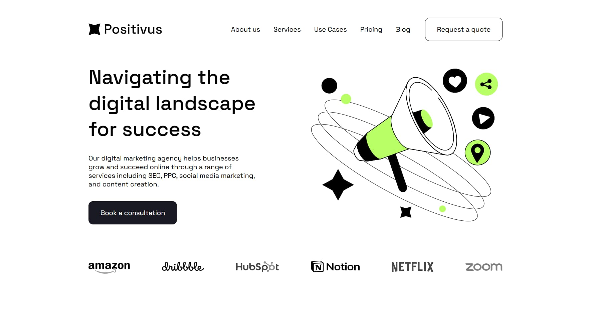

# 🚀 Landing Page Positivus

Современный адаптивный лендинг для портфолио.  
Демонстрирует навыки семантической верстки, адаптива и работы с препроцессорами.

## 🛠️ Технологии

- **Pug** — шаблонизатор HTML
- **SCSS** — препроцессор CSS
- **JavaScript (ES6)**
- **AOS** — Animate On Scroll Library
- **Swiper.js** — слайдер / карусель
- **Prepros** — сборка проекта

## ✨ Features

- Адаптивная верстка
- Семантическая структура
- Анимации при скролле (AOS)
- Чистая SCSS архитектура
- Кроссбраузерная поддержка

## 🚀 Запуск проекта

1. Установить и открыть проект в Prepros
2. Убедиться, что компиляция Pug и SCSS включена
3. Запустить сборку
4. Открыть файл `index.html`

## 🌍 Демо

👉 GitHub Pages:  
https://gostyukhin.github.io/positivus/

## 👨‍💻 Автор

Евгений Гостюхин  
Frontend Developer

GitHub: https://github.com/gostyukhin

## 📸 Превью

## 🎨 Дизайн

🔗 Figma prototype: https://www.figma.com/design/racHPrMNd7jO0XgXQPpE7w/Positivus-Landing-Page-Design--Community-?node-id=25-145&p=f&t=9JB68Dojtx2S9R5I-0
